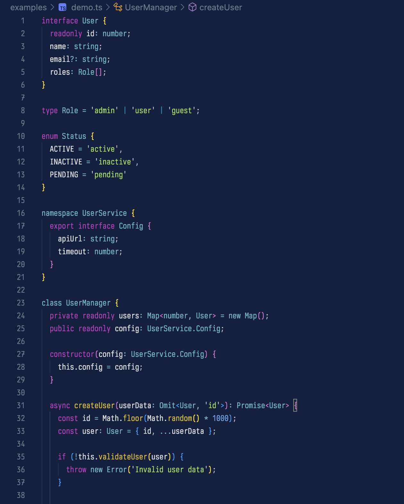

# 🦫 Aardvark Blue Theme Collection for VS Code

**Professional dark theme collection** with **3 distinct variants** inspired by Ghostty's Aardvark Blue. Features comprehensive TypeScript/React syntax highlighting, semantic token support, and consistent cross-platform color mapping.

## 🌟 **Three Theme Variants**

### 🔵 **Aardvark Blue** (Default)
Perfect balance of colors with optimal readability. Ideal for daily coding across all languages.

### ⚡ **Aardvark Blue High Contrast** 
Enhanced contrast for better accessibility and reduced eye strain during long coding sessions.

### 🎯 **Aardvark Blue Minimal**
Subtle color variation focusing on essential syntax elements for distraction-free coding.

## ✨ Features

### 🚀 **v2.0.0 Multi-Variant Collection**
- **3 distinct themes** - Default, High Contrast, and Minimal variants
- **Auto-generated consistency** - All variants generated from unified color system
- **Cross-platform sync** - Consistent colors with Neovim and terminal

### 🎨 **Superior Syntax Highlighting**
- **TypeScript excellence** - Complete support for interfaces, generics, decorators
- **React/JSX mastery** - Component tags, HTML elements, attributes perfectly colored
- **Semantic token support** - Intelligent context-aware highlighting
- **50+ languages** - Universal syntax highlighting coverage

### 🖥️ **Complete UI Integration**
- **Deep blue background** (#102040) for comfortable coding sessions
- **Comprehensive theming** - All UI elements styled consistently
- **Terminal integration** - Perfect ANSI color matching with terminal
- **Accessibility friendly** - WCAG-compliant contrast ratios

## 🎨 Color Philosophy

The theme uses a carefully curated palette based on Ghostty's Aardvark Blue:

- **Keywords** (`if`, `else`, `while`, `try`) → Magenta `#c43ac3`
- **Functions** → Yellow `#dbba00`
- **Strings** → Bright Green `#95dc55`
- **Numbers** → Bright Blue `#60a4ec`
- **Types** → Bright Cyan `#60b6cb`
- **Comments** → Gray `#6a7a8a` (italic)
- **Variables** → White `#dddddd`

### TypeScript Specific

- **Modifiers** (`public`, `private`, `protected`) → Yellow `#dbba00`
- **Type keywords** (`interface`, `type`, `enum`) → Magenta `#c43ac3`
- **Type operators** (`keyof`, `typeof`, `as`) → Cyan `#008eb0`
- **Decorators** (`@Component`) → Cyan `#008eb0`

### React/JSX Specific

- **React Components** (`<Button>`, `<MyComponent>`) → Bright Blue `#60a4ec`
- **HTML Tags** (`<div>`, `<span>`) → Blue `#1370d3`
- **JSX Attributes** (`className`, `onClick`) → Yellow `#ffe763`

## 📦 Installation

### From VS Code Marketplace

1. Open VS Code
2. Go to Extensions (`Ctrl+Shift+X` / `Cmd+Shift+X`)
3. Search for **"Aardvark Blue Theme"**
4. Click Install
5. Choose your preferred variant:
   - **Aardvark Blue** (default)
   - **Aardvark Blue High Contrast** 
   - **Aardvark Blue Minimal**

**Or install directly:** [VS Code Marketplace](https://marketplace.visualstudio.com/items?itemName=SehyunChung.aardvark-blue-theme)

### Theme Selection

After installation, access themes via:
- **Command Palette**: `Ctrl+K Ctrl+T` (or `Cmd+K Cmd+T`)
- **Settings**: `Preferences → Color Theme`

All 3 variants will be available in your theme list!

### Manual Installation

1. Download `aardvark-blue-theme-2.0.0.vsix` from [releases](https://github.com/sehyunchung/aardvark-blue.nvim/releases)
2. Install via command: `code --install-extension aardvark-blue-theme-2.0.0.vsix`  
3. **Or via VS Code**:
   - Open VS Code
   - Run `Extensions: Install from VSIX...` from Command Palette
   - Select the downloaded `.vsix` file
4. Restart VS Code and select your preferred variant

## 🖼️ Screenshots

### TypeScript



Features highlighted in this example:
- **Interface keywords** (`interface`) in magenta
- **Access modifiers** (`readonly`, `private`, `public`) in yellow  
- **Type annotations** (`User`, `number`, `string`) in bright cyan
- **Class keywords** (`class`, `constructor`) in magenta
- **Function names** (`createUser`, `validateUser`) in yellow
- **String literals** in bright green
- **Async/await** keywords in magenta

### React/JSX


Features highlighted in this example:
- **React Components** (`UserCard`, custom components) in bright blue
- **HTML Tags** (`div`, `header`, `span`) in blue
- **JSX Attributes** (`className`, `onClick`, `data-testid`) in bright yellow
- **React Hooks** (`useState`, `useCallback`, `useEffect`) in yellow
- **TypeScript generics** and interfaces
- **Template literals** and expressions in JSX

### Additional Examples

```typescript
// Interface and type definitions
interface User {
  readonly id: number;        // readonly modifier in yellow
  name: string;              // types in bright cyan
  isActive: boolean;         // booleans in bright red
}

export class UserService {   // export/class keywords in magenta
  private users: User[] = [];  // private modifier in yellow
  
  public async getUser(id: number): Promise<User | null> {
    const user = this.users.find(u => u.id === id);  // functions in yellow
    return user ?? null;     // operators in bright cyan
  }
}
```

```jsx
// React component showing color distinction
const UserCard: React.FC<{user: User}> = ({user}) => {
  return (
    <div className="user-card">        {/* HTML tags in blue */}
      <UserAvatar user={user} />       {/* React components in bright blue */}
      <span>{user.name}</span>         {/* Strings in bright green */}
    </div>
  );
};
```

## 🔧 Configuration

### Enable Semantic Highlighting

For the best experience with TypeScript and other languages, enable semantic highlighting in your VS Code settings:

```json
{
  "editor.semanticHighlighting.enabled": true
}
```

### Font Recommendations

The theme works great with these programming fonts:

- [JetBrains Mono](https://www.jetbrains.com/lp/mono/)
- [Fira Code](https://github.com/tonsky/FiraCode)
- [Cascadia Code](https://github.com/microsoft/cascadia-code)

## 🚀 Related Projects

This theme is part of the **Aardvark Blue** ecosystem:

- **[aardvark-blue.nvim](https://github.com/sehyunchung/aardvark-blue.nvim)** - The original Neovim colorscheme
- **Cursor Theme** - Coming soon!

## 🤝 Contributing

Found an issue or have a suggestion? Please [open an issue](https://github.com/sehyunchung/aardvark-blue.nvim/issues) on GitHub.

### Development

1. Clone the repository
2. Open the `extras/vscode` folder in VS Code
3. Press F5 to launch the Extension Development Host
4. Select "Aardvark Blue" theme in the new window

## 📄 License

MIT License - see [LICENSE](../../LICENSE) file for details.

## 🙏 Credits

- Inspired by the [Aardvark Blue](https://github.com/mbadolato/iTerm2-Color-Schemes) terminal theme
- Originally created for [Ghostty](https://ghostty.org/) terminal
- Color palette carefully adapted from the Neovim version
