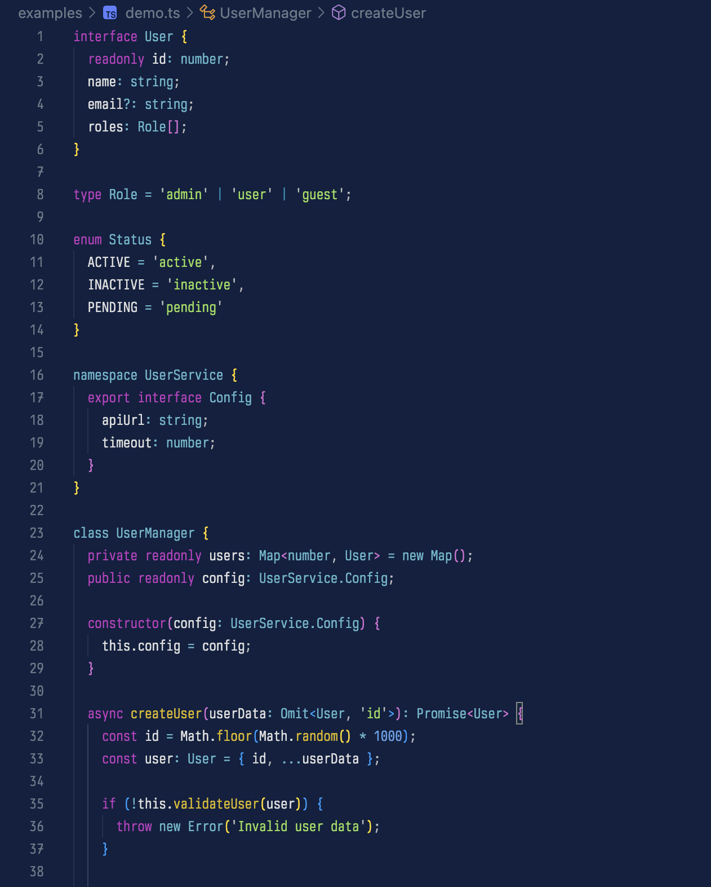
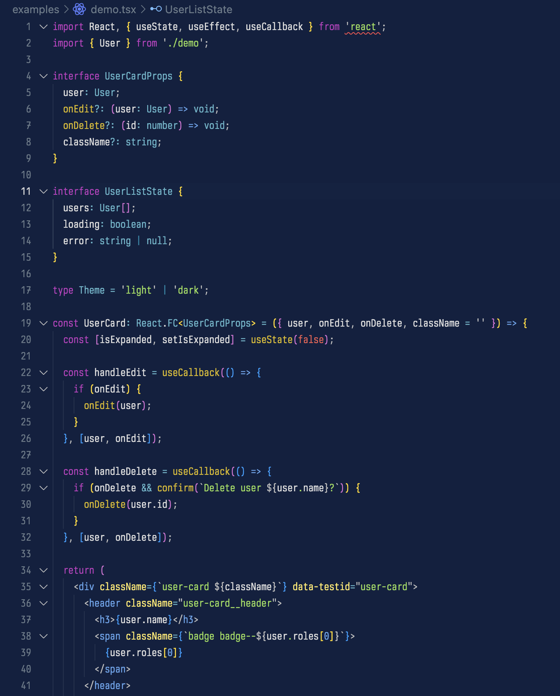

# 🦫 Aardvark Blue Theme for VS Code

Professional dark theme inspired by Ghostty's Aardvark Blue terminal with optimal TypeScript/React support.

## 🖼️ Screenshots

## 📦 Installation

1. Open VS Code Extensions (`Ctrl+Shift+X` / `Cmd+Shift+X`)
2. Search for **"Aardvark Blue Theme"**
3. Click Install
4. Select theme via Command Palette (`Ctrl+K Ctrl+T`)

## ✨ Features

- **TypeScript/React optimized** - Complete syntax highlighting
- **Semantic token support** - Context-aware highlighting  
- **Deep blue background** - Easy on the eyes
- **Cross-platform consistency** - Matches Neovim and terminal

## 🤝 Contributing

[Open an issue](https://github.com/sehyunchung/aardvark-blue.nvim/issues) on GitHub.
